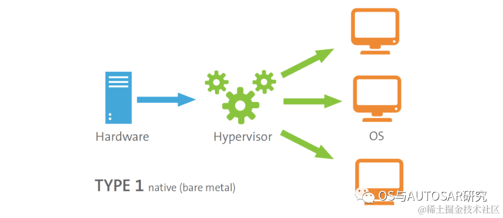
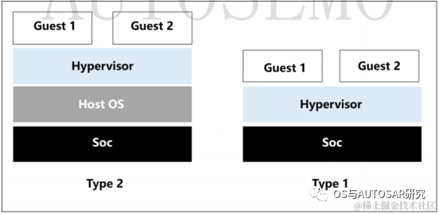
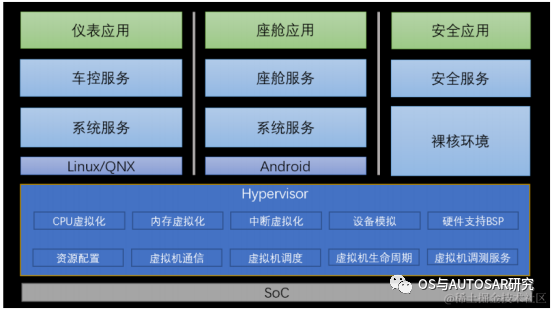
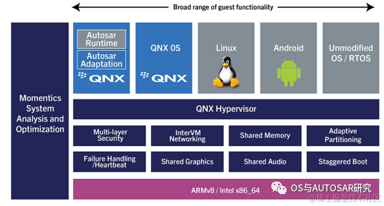
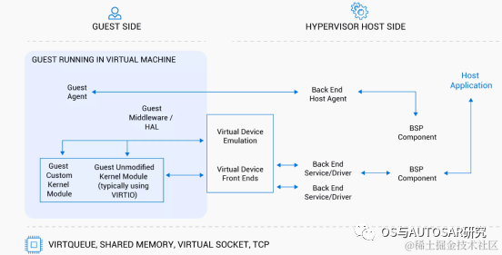
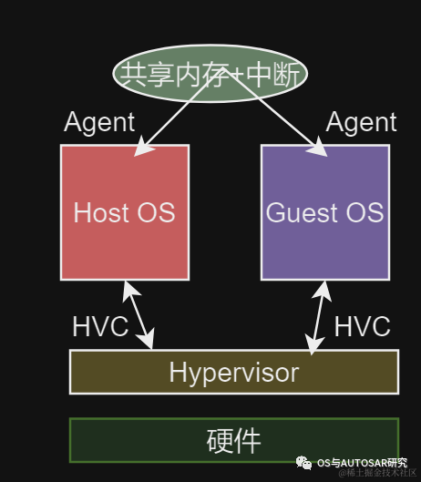

#  电源管理入门-20 Hypervisor中的电源管理   
原创 thatway1989  那路谈OS与SoC嵌入式软件   2023-12-06 07:25  
  
  
  
很多时候听说**Hypervisor**，但是对**底层软件**技术不了解的人感觉**挺神秘**。本篇文章简单介绍下Hypervisor的**基本概念**，另外介绍下电影管理在Hypervisor之上多OS间怎么**应用**。  
# 1. Hypervisor概念介绍  
  
  
  
**虚拟机管理器**，又称Hypervisor ，也称为虚拟机监控程序（**VMM**）,其  
处于**SoC 硬件平台**  
之上，将实体资源（如 **CPU、内存、存储空间、网络适配器、外设等**  
 ) 转换为虚拟资源，按需分配给每个虚拟机，允许它们独立地访问已授权的**虚拟资源**  
。  
  
Hypervisor实现了硬件资源的**整合和隔离**  
，使应用程序既能共享CPU等物理硬件，也能依托不同的内核环境和驱动运行，从而满足现代复杂软硬件系统**多元化**  
应用场景需求。目前，通常使用**两种类型**的管理程序：  
- **Type 1** :**裸机**虚拟机管理程序：一种在硬件上本机运行的管理程序。  
  
- **Type 2** :托管虚拟机监控程序：此类型的虚拟机监控程序必须由另一个**操作系统托管**，并且仅负责使用主机操作系统可用的资源来虚拟化客户操作系统。  
  
<table><thead><tr style="border-width: 1px 0px 0px;border-right-style: initial;border-bottom-style: initial;border-left-style: initial;border-right-color: initial;border-bottom-color: initial;border-left-color: initial;border-top-style: solid;border-top-color: rgb(204, 204, 204);"><th style="text-align: left;border-top-width: 1px;border-bottom: 0px;border-top-color: rgb(0, 150, 136);border-right-color: rgb(0, 150, 136);border-left-color: rgb(0, 150, 136);background-color: rgb(0, 150, 136);color: rgb(248, 248, 248);" width="89">类型</th><th style="text-align: left;border-top-width: 1px;border-bottom: 0px;border-top-color: rgb(0, 150, 136);border-right-color: rgb(0, 150, 136);border-left-color: rgb(0, 150, 136);background-color: rgb(0, 150, 136);color: rgb(248, 248, 248);" width="266">优点</th><th style="text-align: left;border-top-width: 1px;border-bottom: 0px;border-top-color: rgb(0, 150, 136);border-right-color: rgb(0, 150, 136);border-left-color: rgb(0, 150, 136);background-color: rgb(0, 150, 136);color: rgb(248, 248, 248);" width="236">缺点</th></tr></thead><tbody style="border-width: 0px;border-style: initial;border-color: initial;"><tr style="border-width: 1px 0px 0px;border-right-style: initial;border-bottom-style: initial;border-left-style: initial;border-right-color: initial;border-bottom-color: initial;border-left-color: initial;border-top-style: solid;border-top-color: rgb(204, 204, 204);"><td style="border-color: rgb(0, 150, 136);" width="69">Type 1</td><td style="border-color: rgb(0, 150, 136);" width="246">不必预先加载底层操作系统，<strong>直接访问底层硬件</strong>而无需其他软件(例如操作系统和设备驱动程序)，速度快直接在物理硬件上运行相对较安全，因为<strong>裸机</strong>虚拟机管理程序可避免操作系统通常存在的安全问题和漏洞。这可确保每个访客VM与恶意软件和活动保持<strong>逻辑隔离</strong>。</td><td style="border-color: rgb(0, 150, 136);" width="216">移植成本较高</td></tr><tr style="border-width: 1px 0px 0px;border-right-style: initial;border-bottom-style: initial;border-left-style: initial;border-right-color: initial;border-bottom-color: initial;border-left-color: initial;border-top-style: solid;border-top-color: rgb(204, 204, 204);background-color: rgb(248, 248, 248);"><td style="border-color: rgb(0, 150, 136);" width="89">Type 2</td><td style="border-color: rgb(0, 150, 136);" width="246">通用性强，好移植</td><td style="border-color: rgb(0, 150, 136);" width="216">底层操作系统的存在会引入不可避免的<strong>延迟</strong>，因为所有该管理程序的活动和每个VM的工作都必须通过主机操作系统。主机操作系统中的任何<strong>安全问题或漏洞</strong>都可能会危及在其上运行的所有虚拟机。因此，Type2管理程序通常不用于数据中心计算，并且仅用于客户端或最终用户系统，其中<strong>性能和安全性</strong>较少受到关注。</td></tr></tbody></table>  
VMM首先需要对CPU、内存、中断等资源进行管理，并提供对应虚拟化功能；按照I/O设备驱动的布局，又可以分为  
**Hypervisor模型**和  
**混合模型**；  
- **Hypervisor模型：** VMM设备驱动提供物理设备驱动管理，并向上提供服务；  
  
- **混合模型：** VMM只提供必要的CPU资源管理，由Guest Server OS提供设备管理和虚拟化服务。  
  
> Type 1和2的区别就是管理硬件的程序放**OS还是OS之下**，全放OS就是Type 2，全放OS之下就是Type 1.  
> 驱动程序放OS里面的话会引起两个OS直接**通信的开****销**，全放OS之下VMM的话，VMM**驱动开发工作量较大**，因为OS里面的驱动基本就是现成的，VMM里面很大可能没可以抄的驱动。  
  
  
参考Hypervisor模型：**QNX**  
  
参考混合模型：代表有  
- [**Xen**](https://xenproject.org/)，  
  
- **Intel**的[Acrn](https://projectacrn.org/)，  
  
- 以及国内的[**minos**](https://github.com/minosproject/minos)，  
  
- 和[**bao-hypervisor**](https://github.com/bao-project/bao-hypervisor)  
  
# 2. 汽车软件中的Hypervisor应用  
  
  
  
**Hypervisor**处于 SoC 硬件平台之上，将实体资源（如 CPU、内存、存储空间、网络适配器、外设等 ) 转换为**虚拟资源**，按需分配给每个虚拟机，允许它们独立地访问已授权的虚拟资源。Hypervisor 实现了**硬件资源的整合和隔离**，使应用程序既能共享 CPU 等物理硬件，也能依托不同的内核环境和驱动运行，从而满足汽车领域多元化应用场景需求。  
> 为什么汽车中迫切需求Hypervisor？  
> 汽车上有三个域：**车身域、座舱域、智驾域**。也就是说有三个OS运行在复杂的SoC上。在域融合的同时，要保证关键业务的**安全可靠**，也要考虑应用生态的可持续性兼容，这就需要有**资源隔离技术**来支撑在同一 SOC 上切分资源，可并发运行多种操作系统，保障互不干扰。基于安全和资源隔离的需求需要Hypervisor。  
  
> 资源隔离技术有很多，为什么是Hypervisor？  
> 资源隔离技术有多种，从硬件底层逐层向上包括**硬件隔离、虚拟化隔离、容器隔离、进程隔离等**。硬件隔离的隔离性最好，单隔离域的性能、安全可靠性最好，但灵活性、可配置性差，不能实现硬件共享，导致整个系统的资源利用率差，不能充分达到软件定义汽车的目标。容器隔离、进程隔离可以更轻量级地实现业务隔离，但还是在同一个操作系统内，存在着资源干扰、相互安全攻击的隐患，并且无法支持异构操作系统业务域融合，影响传统业务继承，不利于生态发展。在众多的资源隔离技术中，虚拟化是安全可靠、**弹性灵活**的优选方案，是软件定义汽车的重要支撑技术。  
  
  
在汽车领域，Hypervisior 主要完成以下任务：  
1. 虚拟化：为虚拟机提供 VCPU 资源和运行环境；  
  
1. 内存虚拟化：负责为其自身和虚拟机分配和管理硬件内存资源；  
  
1. 中断虚拟化：发生中断和异常时，按需将中断和异常路由到虚拟机进行处理；  
  
1. 虚拟机设备模拟：根据需求创建虚拟机可以访问的虚拟硬件组件；  
  
1. 硬件支持 BSP：提供 Hypervisor 在 SoC上运行的板级支持包，如串口驱动；  
  
1. 虚拟机资源配置：对虚拟机的 CPU，内存，IO 外设等资源进行配置和管理；  
  
1. 虚拟机通信：为虚拟机提供 IPC，共享内存等通信机制。  
  
1. 虚拟机调度：为虚拟机提供优先级和时间片等调度算法；  
  
1. 虚拟机生命周期管理：创建，启动和停止虚拟机；  
  
1. 虚拟机调测服务：提供控制台，日志等调试功能；  
  
# 3. QNX Hypervisor  
  
  
  
QNX Hypervisor是基于**Type 1**实时优先级的微内核管理程序，用于管理虚拟机。在QNX ® 虚拟机管理程序可以更容易地获得并通过从不同的客户机操作系统的非安全关键组分分离安全关键部件保持安全认证。QNX Hypervisor能够满足嵌入式**零停机**生产系统的精度要求。  
  
基于标准的访客通信（**virtIO**）和灵活的虚拟机配置确保了虚拟机管理程序环境可以扩展到大型服务器级设计（根据自动驱动器和高端计算系统的要求）。此外，虚拟机管理程序环境可以扩展到深度嵌入式系统（**集群+信息娱乐汽车系统，ECU整合，医疗设备，工业控制**）。QNX Hypervisor实现为经过业界验证的基于QNX Neutrino**微内核**的RTOS的虚拟化扩展; 继承QNX操作系统的所有实时性和稳定性，该操作系统已经在全球数百万个嵌入式系统中提供。  
- Type 1 Hypervisor  
  
- 安全认证谱系  
  
- 虚拟CPU模型  
  
- 根据优先级固定核心或共享核心  
  
- 自适应分区 - 允许客户运行时的CPU保证  
  
- 64位和32位客户：QNX，Linux，Android，RTOS  
  
- 共享内存与触发  
  
- VirtIO（0.95 / 1.0）设备共享  
  
- TAP和具有桥接功能的点对点网络  
  
- 故障检测并重新启动客人  
  
- 用于访客完整性检查的虚拟监视器  
  
- 低开销（典型<2％）  
  
- 用于分析和调试的图形工具  
  
**VM间通信**  
  
运行在多个虚拟机中的应用程序必须协同工作才能提供嵌入式设备的服务。通过这种方式，QNX Hypervisor支持**共享内存**访问，共享文件访问以及虚拟机之间的TCP / IP / UDP网络。  
  
  
  
QNX (®)高级虚拟化框架 (**QAVF**) 扩展了 QNX (®)管理程序和 QNX (®)安全管理程序，提供高级虚拟化软件组件，使 Android (®)、Linux (®)和 QNX (®)等来宾能够在涉及安全性的复杂环境中共存，安全认证、设备抽象和设备共享。  
  
通过遵循 VIRTIO 等开放标准，未经修改的 Android 和 Linux 客户机可以共享底层硬件和高级软件服务，例如图形显示、声学环境、触摸屏、媒体存储设备、视频流、相机、通信、蓝牙 ®(等)。  
  
**QAVF**允许在访客外部共享设备。这是支持响应式用户体验的重要功能。例如，它使用户能够在来宾仍在启动时与硬件设备（如相机、显示器、音频或触摸屏）进行交互。  
# 4. Hypervisor中的多OS通信技术  
  
  
  
Hypervisor中有很多技术，例如  
**CPU 虚拟化和节能降耗技术**、**IO 设备虚拟化**、**实时性技术**、**安全和可靠性技术**等，大家可以自己查资料去学习，特别是参考国内的minos，bao-hypervisor开源软件去学习，修改，使用（大家懂的）。  
  
这里主要介绍下多OS的**通信技术**，后面在介绍多OS电源管理时会用到。  
  
Hypervisor（虚拟化管理程序）是一种软件或硬件层面的虚拟化技术，用于在物理计算机上运行**多个虚拟操作系统**（OS）。Hypervisor需要提供一种有效的机制，以便不同虚拟机（VM）之间以及虚拟机与宿主机（host）之间进行通信。以下是几种常见的Hypervisor的OS间通信机制：  
  
1. **虚拟网络**：Hypervisor可以创建虚拟网络，为虚拟机提供网络连接和通信功能。虚拟网络允许虚拟机之间进行网络通信，就像它们连接在同一物理网络上一样。这种通信机制基于网络协议和虚拟网络设备的实现。  
  
2. **共享内存**：Hypervisor可以在物理内存中创建共享区域，允许不同的虚拟机共享内存数据。通过在共享内存区域中读取和写入数据，虚拟机可以进行相互通信。这种通信机制可以在虚拟机之间高效地传递数据，但需要适当的同步和互斥机制来处理并发访问。  
  
3. **虚拟设备和驱动程序**：Hypervisor可以为虚拟机提供虚拟设备和驱动程序，使得虚拟机可以与宿主机和其他虚拟机进行通信。通过虚拟设备接口和相关驱动程序，虚拟机可以发送和接收数据包、访问存储资源和执行其他设备相关的操作。  
  
4. **信号和事件**：Hypervisor可以使用信号和事件机制来实现虚拟机之间的通信。例如，一个虚拟机可以向Hypervisor发送信号，通知其他虚拟机发生了特定事件或状态变化。这些信号可以在虚拟机之间进行同步或触发相应的处理逻辑。  
  
5. **宿主机通道**：有些Hypervisor提供了特定的宿主机通道，允许虚拟机与宿主机之间进行通信。这些通道可以用于传递命令、状态信息、性能指标等。通常，宿主机通道是通过特定的API或驱动程序提供的。  
  
其实就是：  
- 要么**共享内存+中断**，  
  
- 要么寄存在**某个程序**上（驱网络动、虚拟设备驱动）  
  
- 要么Hypervisor加一套**消息处理通道**机制（事件、信号、通道）。  
  
# 5. 电源管理相关  
  
例如司机不开车时**对整车进行关机**，那么这个命令如何在三个OS直接传递执行，这里必须有一个次序，并且有一个代理人。比如**司机**（**上帝**）发送了一个指令给汽车，汽车里面的**车控OS**最先接收到指令（教皇），然后教皇下令给**座舱OS**（**大主教**），大主教继续给**智驾OS**（**主教**）传达命令，然后各自去完成指令。  
  
  
  
教皇就是Host OS，其他的都是Guest OS。Host OS和Guest OS的**通信**  
就是上面3章说的一种方法即可。例如采用**中断+共享内存**  
，那么两个OS都需要注册对应的中断处理函数，映射好共享内存，Guest OS一旦接受到中断，读取共享内存中的命令后就去执行。  
  
不管是Host OS或者Guest OS执行电源命令都是通过**HVC命**令陷入到Hypervisor去处理。  
# 参考：  
1. https://www.3cst.cn/Information/info/TUiXshpYUrE411ea8d6300163e0473d8  
  
> 后记：  
> 写的有点**繁杂**，不过正好就是这个写作风格，啥都涉及一点，**点到为止**，实际应用的时间再代码见。  
  
  
干啥都能干，干啥啥不是，  
  
专业入门劝退，堪称程序员杂家”。  
  
欢迎各位有自己公众号的留言：**申请转载**，多谢！  
  
后续会继续更新，纯干货分析，欢迎分享给朋友，欢迎点赞、收藏、在看、划线和评论交流！  
  
